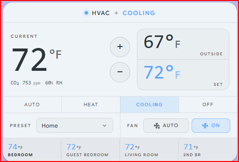
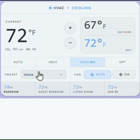

# Simple Compact Thermostat

A clean, information-dense thermostat card for Home Assistant — three compact rows with the controls you actually use, color-coded HVAC modes, auto-discovered weather and room sensors, and optimistic UI that snaps to your touch.

<p align="center">
  
</p>

<p align="center">
  <a href="https://github.com/hacs/integration"></a>
  <a href="https://github.com/priyam13coding/simple-compact-thermostat-card/releases"></a>
  <a href="LICENSE"></a>
  <a href="https://github.com/priyam13coding/simple-compact-thermostat-card/stargazers"></a>
</p>

<p align="center">
  
</p>

---

## ✨ Features

|  |  |
|---|---|
| **🎨 Three-row layout** | Status header, big current temp + setpoint controls, HVAC mode strip, preset + fan row. Everything important in one glance. |
| **🌡️ Dual setpoint** | Auto / heat_cool entities show heat and cool setpoints inline, color-coded, with single-tap adjustment. |
| **💨 CO₂ + humidity sub-stats** | Auto-discovers air-quality sensors on the same device as your climate entity and shows them under the current temp. Values turn red when above your configurable thresholds (1000 ppm CO₂ and 60 % RH by default). |
| **👥 Occupancy detection** | If your remote sensors expose an `occupancy` binary sensor, the room name is bolded whenever someone is in the room. |
| **🌤️ Auto-discovered outside temp** | Reads from a `weather.*` entity on the same device. Override with any `sensor.*` if you prefer your own forecast. |
| **🏠 Auto-discovered room sensors** | Ecobee remote sensors (and any integration exposing `available_sensors`) appear in a grid at the bottom. The ones contributing to the current reading are highlighted. |
| **⚡ Optimistic UI** | Tap a button — the card flips immediately, doesn't wait for the next integration poll. Falls back to the real state if the change doesn't stick. |
| **🎯 "Custom" preset state** | When you manually override a named preset (e.g. by adjusting the temperature on Home), the preset label flips to *Custom* so you know you're off-script. |
| **🌗 Theme-aware** | Uses Home Assistant theme variables for surfaces and text; mode colors flow through `--sct-*` CSS variables so any theme or `card-mod` can recolor freely. |
| **♿ Accessible** | All interactive controls are real `<button>` elements with proper aria-labels and keyboard support. |
| **🛠️ GUI editor** | Add the card via the dashboard editor and you get a visual form for the common options. Advanced options stay in YAML for full control. |

---

## 📦 Installation

### Via HACS (recommended)

1. Open **HACS → Frontend**.
2. Click the **⋮** menu in the top-right → **Custom repositories**.
3. Paste `https://github.com/priyam13coding/simple-compact-thermostat-card` and select **Lovelace**.
4. Search for **Simple Compact Thermostat** → **Download**.
5. Hard-refresh your dashboard (Ctrl/⌘+Shift+R).

> Once accepted into the [HACS default store](https://github.com/hacs/default), step 2–3 will be replaced by a single search.

### Manual

1. Download `simple-compact-thermostat.js` from the [latest release](https://github.com/priyam13coding/simple-compact-thermostat-card/releases/latest).
2. Copy it to `<config>/www/simple-compact-thermostat.js`.
3. **Settings → Dashboards → ⋮ → Resources → Add Resource**
   - URL: `/local/simple-compact-thermostat.js`
   - Type: **JavaScript Module**
4. Hard-refresh your dashboard.

---

## 🚀 Quick start

The minimum config is one line:

```yaml
type: custom:simple-compact-thermostat
entity: climate.thermostat
```

Everything else — outside temp, room sensors, preset list, fan modes — is discovered from your climate entity automatically.

---

## ⚙️ Configuration

| Key                   | Type      | Default                    | Description                                                       |
|-----------------------|-----------|----------------------------|-------------------------------------------------------------------|
| `type`                | string    | **required**               | `custom:simple-compact-thermostat`                                |
| `entity`              | string    | **required**               | A `climate.*` entity.                                             |
| `name`                | string    | (none)                     | Optional card title above the display.                            |
| `outside_temp_entity` | string    | (auto)                     | A `sensor.*` or `weather.*` entity. Defaults to the `weather.*` entity on the same device, falling back to `weather.<climate_slug>`. |
| `hvac_modes`          | string[]  | (entity's modes)           | Subset of HVAC modes to show in the strip.                        |
| `fan_modes`           | string[]  | `["auto", "on"]`           | Which fan modes to show as buttons.                               |
| `show_preset`         | boolean   | `true`                     | Show the preset dropdown.                                         |
| `show_fan`            | boolean   | `true`                     | Show the fan buttons.                                             |
| `step`                | number    | `1`                        | Setpoint increment per `−` / `+` press, in the entity's unit.     |
| `show_sensor_data`    | boolean   | `true`                     | Show the auto-discovered room-sensor row.                         |
| `room_sensor_columns` | number    | `4`                        | Number of columns in the room-sensor grid.                        |
| `sensor_excludes`     | string[]  | `["Thermostat"]`           | Sensor names to skip in the room-sensor row.                      |
| `sensor_aliases`      | object    | `{}`                       | `{ "Original Name": "Short Label" }` to rename a cell.            |
| `sensor_occupancy`    | object    | `{}`                       | `{ "Original Name": "binary_sensor.x_occupancy" }` to manually map a sensor to its occupancy binary_sensor. Auto-discovered if omitted. |
| `sensor_humidity`     | object    | `{}`                       | `{ "Original Name": "sensor.x_humidity" }` to manually map an auto-discovered room sensor to its humidity sensor. Auto-discovered on the same device if omitted. |
| `room_sensors`        | list      | (none)                     | Manual sensor list. When set, replaces auto-discovery — use this when your climate integration doesn't expose `available_sensors` (e.g. Ecobee 3 Lite, non-Ecobee) or when you want to pull in third-party Zigbee/ESPHome sensors. See [Manual room sensors](#manual-room-sensors). |
| `additional_room_sensors` | list  | (none)                     | Extra sensors appended to whichever list (auto-discovered or `room_sensors`) is in effect. Use to add a third-party Zigbee/Aqara/ESPHome sensor alongside Ecobee's remote sensors without losing the auto-discovered ones. Same shape as `room_sensors`. |
| `co2_entity`          | string    | (auto)                     | A `sensor.*` for CO₂ ppm. Defaults to the sensor with `device_class: carbon_dioxide` on the same device as the climate entity. |
| `humidity_entity`     | string    | (auto)                     | A `sensor.*` for relative humidity. Defaults to the sensor with `device_class: humidity` on the same device. |
| `show_co2`            | boolean   | `true`                     | Set `false` to hide the CO₂ stat even when one is found.          |
| `show_humidity`       | boolean   | `true`                     | Set `false` to hide the humidity stat even when one is found.     |
| `co2_warning_threshold` | number  | `1000`                     | CO₂ value (in the sensor's unit, normally ppm) above which the number renders red. |
| `humidity_warning_threshold` | number | `60`                  | Humidity % above which the number renders red.                    |

### Full example

```yaml
type: custom:simple-compact-thermostat
entity: climate.thermostat
outside_temp_entity: weather.pirateweather       # override the auto-discovered one
hvac_modes: [heat, cool, heat_cool, "off"]       # control the order; "Auto" label maps to heat_cool
fan_modes: [auto, "on"]
step: 1
show_sensor_data: true
room_sensor_columns: 4
sensor_excludes:
  - Thermostat
sensor_aliases:
  "Second Bedroom Temp": "2nd BR"
```

---

## 🎨 Theming

Every color the card draws routes through a CSS variable so you can recolor it without touching the source.

| Variable               | Default   | Used for             |
|------------------------|-----------|----------------------|
| `--sct-mode-cool`      | `#58a6ff` | Cool mode highlight  |
| `--sct-mode-heat`      | `#f0883e` | Heat mode highlight  |
| `--sct-mode-auto`      | `#3fb950` | Auto mode highlight  |
| `--sct-mode-heat-cool` | `#d2a8ff` | heat_cool highlight  |
| `--sct-mode-fan`       | `#79c0ff` | fan_only highlight   |
| `--sct-mode-dry`       | `#d29922` | dry mode highlight   |
| `--sct-mode-off`       | `#8b949e` | off mode highlight   |

### `card-mod` examples

Bigger setpoint, classic-red heat:

```yaml
type: custom:simple-compact-thermostat
entity: climate.thermostat
card_mod:
  style: |
    ha-card {
      --sct-mode-heat: #f44336;
    }
    .big-temp { font-size: 80px; }
```

Subtle tinted background per HVAC mode:

```yaml
card_mod:
  style: |
    ha-card {
      background: color-mix(in srgb, var(--sct-mode-color) 6%, var(--card-background-color));
    }
```

### Theme example

Drop into `themes.yaml` to make these colors part of a theme:

```yaml
Material You:
  modes:
    light: {}
    dark: {}
  sct-mode-cool: "#1976d2"
  sct-mode-heat: "#ff5722"
  sct-mode-auto: "#388e3c"
  sct-mode-off:  "#9e9e9e"
```

---

## 🔍 Auto-discovery, in detail

### Outside temperature

Resolution order:

1. Explicit `outside_temp_entity` (can be `sensor.*` or `weather.*`).
2. The first `weather.*` entity on the **same device** as the climate entity.
3. `weather.<climate-slug>` fallback (e.g. `climate.thermostat` → `weather.thermostat`).
4. None → renders `—`.

### Room sensors

If your climate entity exposes an `available_sensors` attribute (Ecobee, Honeywell T-series, …), the card:

1. Parses the names (handles both `"Name (id)"` strings and `{name, id, ...}` objects).
2. Finds the matching `sensor.*` temperature entity on the same device, with `_2`/`_3` disambiguation for duplicates.
3. Highlights cells whose name appears in `active_sensors` — tinted background plus mode-colored temperature.
4. Auto-excludes the main thermostat sensor so the value isn't shown twice.

### Manual room sensors

If your climate integration doesn't expose `available_sensors` (e.g. **Ecobee 3 Lite**, most non-Ecobee thermostats), or you want to use any temperature sensor regardless of integration, list them explicitly with `room_sensors`. When this option is set, auto-discovery is skipped entirely.

```yaml
type: custom:simple-compact-thermostat
entity: climate.thermostat
room_sensors:
  - name: Living Room
    entity: sensor.living_room_temperature
    occupancy_entity: binary_sensor.living_room_motion   # optional — bolds the name when occupied
    humidity_entity: sensor.living_room_humidity         # optional — small % next to the temp
  - name: Bedroom
    entity: sensor.aqara_bedroom_temperature
    short: Bedroom                                       # optional — cell label
    stats:                                               # optional — extra values under the temp
      - entity: sensor.purifier_bedroom_pm25
        label: PM2.5
        warn_above: 25
      - entity: sensor.radon_bedroom_co2
        label: CO₂
        unit: ""                                         # hide the sensor's unit
        warn_above: 1000
    tooltip_sensors:                                     # optional — values shown only on hover
      - entity: sensor.radon_bedroom_vocs
        label: VOC
      - entity: sensor.radon_bedroom_pressure
        label: Pressure
  - name: Office
    entity: sensor.esphome_office_temperature
    occupancy_entity: binary_sensor.aqara_office_motion
```

Each entry takes a `name` (display label + matched against the climate entity's `active_sensors` attribute for highlighting), an `entity` (any `sensor.*` providing temperature), and optionally: an `occupancy_entity` (any `binary_sensor.*`), a `humidity_entity` (rendered as a small percentage beside the temperature, red above `humidity_warning_threshold`), a `short` alias, and two stat lists.

`stats` renders extra measurements (PM2.5, CO₂, VOC, mold %, …) in a small line under the temperature; `tooltip_sensors` shows them only in the cell's hover tooltip. Both take the same entry shape: `entity` (required), `label`, `unit` (override; `""` hides it), `warn_above` / `warn_below` (numeric thresholds that turn the value red). Non-numeric states (e.g. `excellent`) render as-is.

---

## 🤔 FAQ

**My HVAC mode change shows immediately but the entity attribute lags. Is that the card?**
No — that's the integration's polling cadence (Ecobee defaults to ~3 minutes). The card uses optimistic UI so the visible state flips on tap; the underlying entity catches up on the next poll. If the change is rejected, the card reverts after 5 minutes.

**Why doesn't the preset show "Home" after I tap `+`/`−`?**
Most thermostats put you into a *temporary hold* the moment you deviate from a preset. The card detects this and shows **Custom** in italics so you know you're not on a saved preset anymore.

**The room-sensor row is empty.**
Your climate entity probably doesn't expose an `available_sensors` attribute. Open Developer Tools → States → your entity and check. If it does, paste the value as a bug report and we'll tune the matcher.

**Can I move heat and cool setpoints independently in Auto mode?**
Not yet — the `+`/`−` buttons currently shift the comfort range together. Independent control is on the roadmap.

---

## 🛣️ Roadmap

- [ ] Independent heat/cool setpoint adjustment in dual mode
- [ ] Lovelace GUI editor (entity picker, theming dropdown)
- [ ] More fan-mode icons (e.g. `diffuse`, `focus`)
- [ ] Optional humidity row
- [ ] Animations on setpoint change
- [ ] Internationalization (current strings are English-only)

---

## 🛠️ Development

```bash
git clone https://github.com/priyam13coding/simple-compact-thermostat-card
cd simple-compact-thermostat
npm install
npm run build   # produces dist/simple-compact-thermostat.js
npm run watch   # rebuilds on save
```

The card is built with **LitElement + TypeScript + Rollup**. See [`src/`](src/) for the source.

PRs welcome — pick something from the roadmap, open an issue first if it's a bigger change.

---

## 📜 License

[MIT](LICENSE)

Built with care for the Home Assistant community. If this card saved you a click, [star the repo](https://github.com/priyam13coding/simple-compact-thermostat-card) — it helps others discover it.
